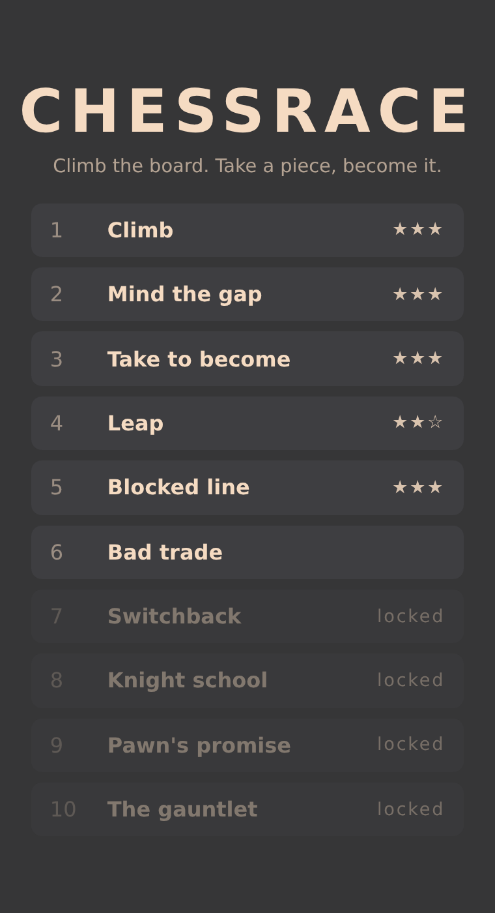
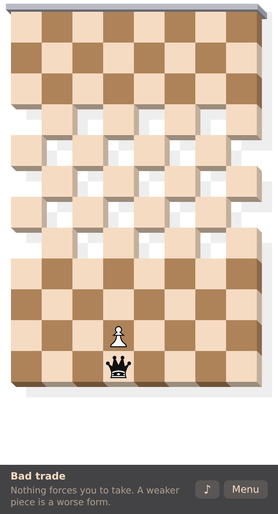

# Chessrace

An endless runner played with the movement rules of chess. The board scrolls
down, you climb it. Holes kill. **Take a piece and you become it.**

**[Play it](https://shallowred.github.io/chessrace/)**

<p>
  
  
</p>

## How it plays

You start at the bottom of the board as one chess piece and click the square
you want to reach. The board scrolls down from the first move onward, so
standing still is fatal: fall off the bottom and the run is over.

- A hole kills you, and a long range piece dies crossing one.
- An enemy piece blocks the line of a bishop, rook or queen. The knight is the
  only piece that jumps over anything.
- Capturing turns you into the piece you took, which is the only way to change
  how you move — and the only way to make yourself worse.
- Reach the row past the top of the board to win.

Ten levels, opened in order. The first six each teach one rule; the last four
speed up as you climb.

## Running it

```sh
npm install
npm run dev        # vite dev server
npm run build      # static bundle in dist/
npm test           # vitest
npm run lint       # eslint
npm run typecheck  # tsc --noEmit
```

Vanilla TypeScript, no runtime dependency. The board is drawn on seven stacked
canvases, one per face of the pseudo-3D extrusion, and scrolling is a CSS
transform on their containers — there is no render loop.

## Deploying

`checks.yml` runs lint, typecheck, tests and build. It runs on its own for
pull requests and side branches, and is called as a gate by the deploy, so
nothing reaches either site without passing it first.

| Branch    | Site                                                  |
|-----------|-------------------------------------------------------|
| `staging` | <https://shallowred.github.io/chessrace/staging/>     |
| `master`  | <https://shallowred.github.io/chessrace/>             |

Both publish to the `gh-pages` branch, production at the root and staging under
`staging/`, each replacing only its own files. Pages must be set to serve from
the `gh-pages` branch for this to work.

## Writing a level

Levels are grids, read top down the way the board is played:

```
...__...
..____..
.._N__..
```

`.` is a square, `_` a hole, and `BKNPQR` an enemy piece. The grid compiles to
the digit blueprint the engine stores, so a whole level is a short string.

Levels are assembled from a vocabulary of named patterns — `laneChasm`,
`checkerVoid`, `steppingStones`, `gate`, `bait`, `ladder` and friends — each
declaring which pieces can cross it. A test checks that claim against the
solver from every entry column, so a pattern cannot quietly stop meaning what
it says.

That same solver walks the state space of `(square, piece)` with the real move,
trajectory and capture rules. It is what proves every shipped level is
winnable, what sets the par a run is rated against, and what caught a
supposedly hard level that turned out to be a one move walk.

## Layout

```
src/app/level/        catalogue, notation, patterns, model, solver, par
src/app/game-objects/ board geometry, canvases, pieces
src/app/game-events/  the rules, as handlers on a typed event bus
src/app/ui/           menu, hud, end of run screen, sound
src/app/config.ts     the numbers worth turning
test/                 the pure logic, no dom
```
